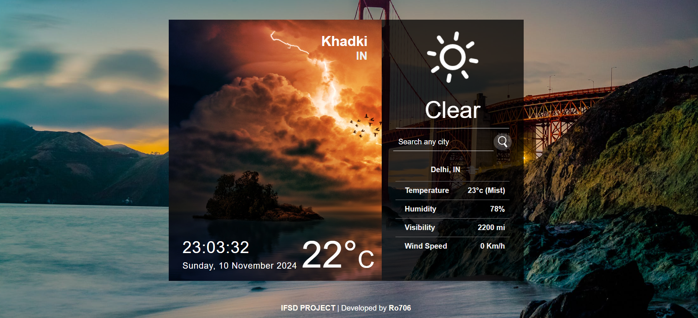

# WeatherApp

This is a visually dynamic weather application built with React.js. It provides real-time weather information for various cities around the world. The user-friendly interface allows users to search for any city and receive updated weather data, including temperature, humidity, visibility, and wind speed.

### Features
- **Real-Time Weather Updates**: Displays current weather conditions such as temperature, humidity, visibility, and wind speed.
- **City Search**: Allows users to search for any city to get the latest weather information.
- **Time and Date Display**: Shows the current time and date, enhancing the real-time aspect of the application.
- **Dynamic Background**: Background images change based on weather conditions, adding an immersive feel to the app.

### Screenshot


### Example
In the screenshot above:
- The app shows the weather for "Khadki, IN."
- The weather condition is "Clear," with a temperature of 22°C.
- Additional data includes:
  - Temperature in Delhi, IN: 23°C (Mist)
  - Humidity: 78%
  - Visibility: 2200 meters
  - Wind Speed: 0 Km/h

### Technologies Used
- **React.js**: For building the user interface.
- **OpenWeather API**: For fetching real-time weather data.
- **CSS & Bootstrap**: For styling and responsive layout

### api key
```js
module.exports = {
  key: "{Your API key}",
  base: "https://api.openweathermap.org/data/2.5/",
};
```


### MADE BY
- Ambar 
- Ankush 
- Siddhi
- Ruthvik
- Alakshendra 
- Rohit